# 🍽️ Mess Bill Management System

A web-based **Mess Bill Management System** developed using **Java, JSP, Servlets, Hibernate, MySQL, and Maven**. The application automates hostel mess operations, including student management, attendance tracking, bill generation, payment processing, and email notifications.

---

## 🚀 Features

- 🔐 Secure Admin Login
- 👨‍🎓 Student Management (Add, Update, Delete, View)
- 🍽️ Meal Attendance Tracking
- 💰 Automatic Monthly Bill Generation
- 💳 Payment Processing
- ⏰ Late Fee Calculation
- 📧 Email Notifications for Bills and Payments
- 📊 Reports and Dashboard
- 📝 Payment History

---

## 🛠️ Tech Stack

### Backend
- Java
- JSP
- Servlets
- Hibernate
- Maven

### Frontend
- HTML
- CSS
- JavaScript

### Database
- MySQL

### Tools
- Eclipse IDE
- Apache Tomcat
- Git
- GitHub

---

## 📂 Project Structure

```
src
 ├── main
 │   ├── java
 │   ├── resources
 │   └── webapp
 │
 ├── Controller
 ├── Entity
 ├── Repository
 ├── Service
 └── JSP Pages
```

---

## ⚙️ Installation

1. Clone the repository

```bash
git clone https://github.com/tarun010604/mess-bill-management-system.git
```

2. Import the project into Eclipse.

3. Configure MySQL.

4. Update database credentials in `persistence.xml`.

5. Configure email settings in `EmailService.java`.

6. Run using Apache Tomcat.

---

## 📷 Screenshots

## 📷 Application Screenshots

### 🔐 Login Page

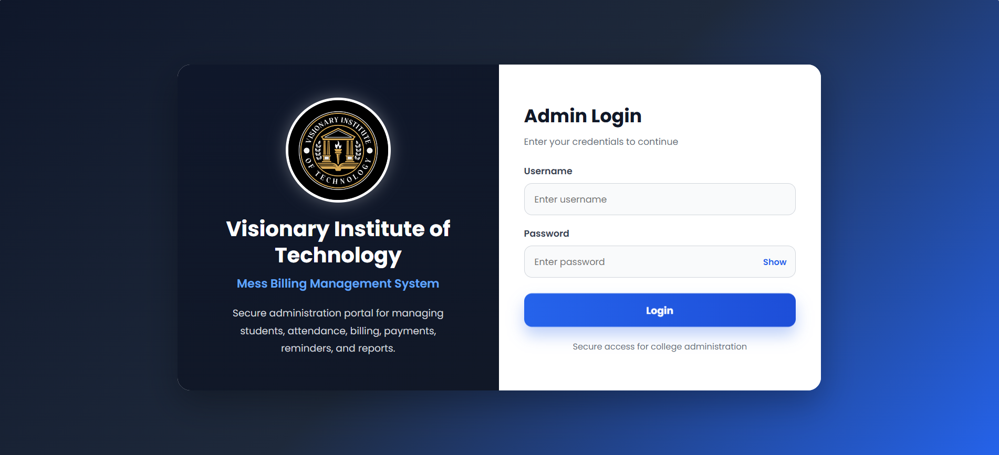

---

### 🏠 Dashboard

| Dashboard Overview | Dashboard Analytics |
|---------------------|---------------------|
| 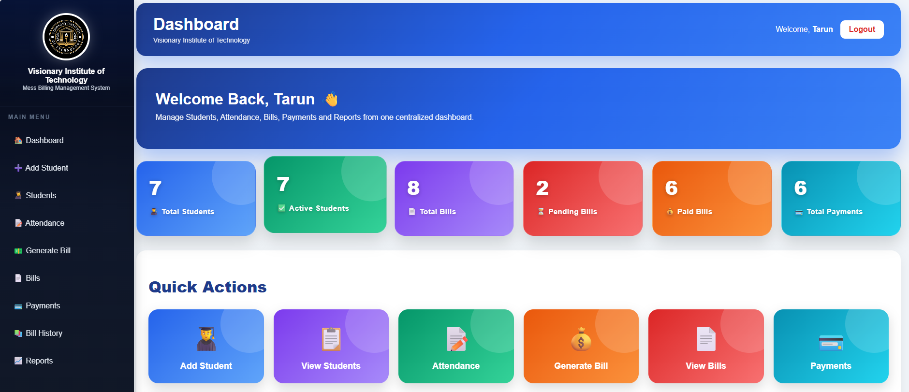 | 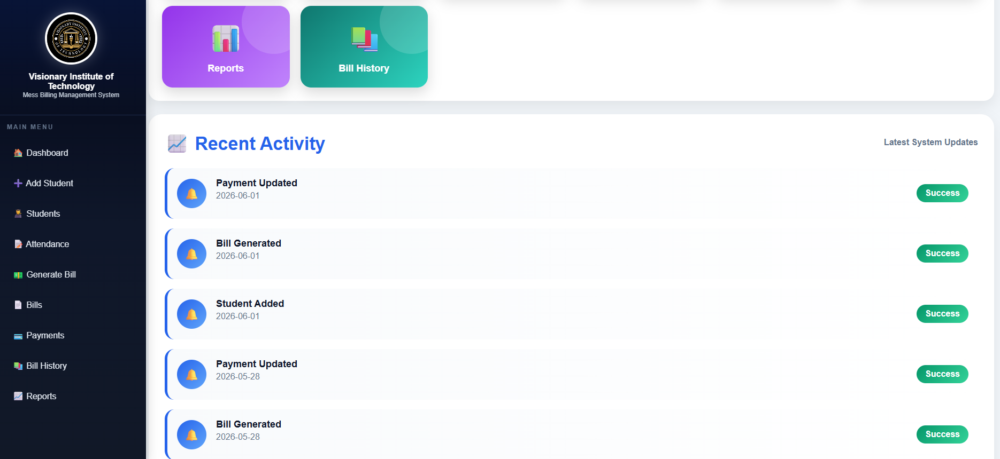 |

---

### 👨‍🎓 Student Management

| Add Student | View Students |
|-------------|---------------|
| 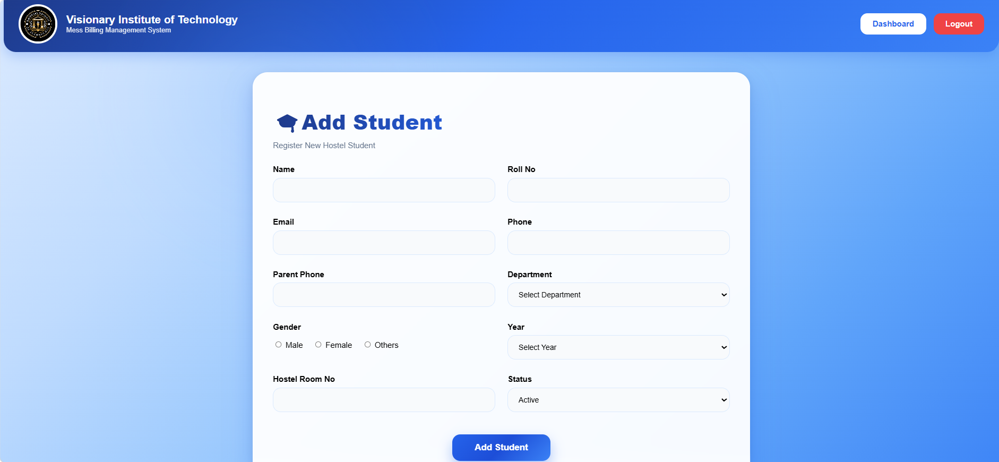 | 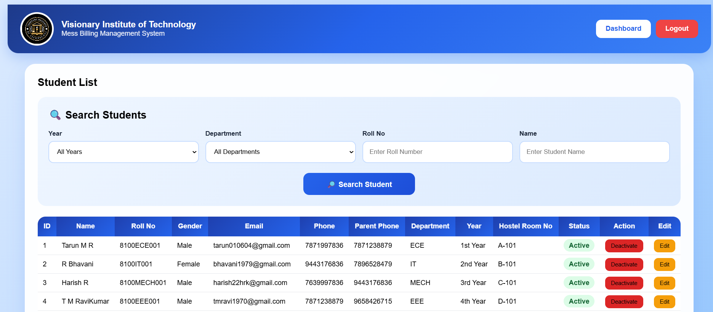 |

---

### 🍽️ Attendance Management

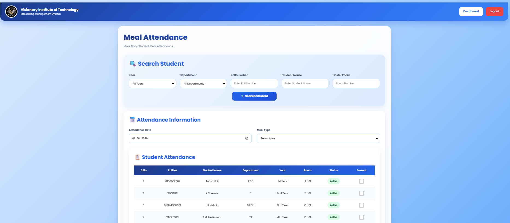

---

### 💰 Bill Generation

| Generate Bill | Bill History |
|---------------|--------------|
| 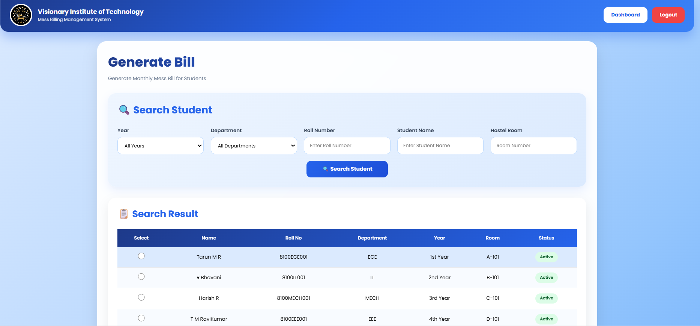 | 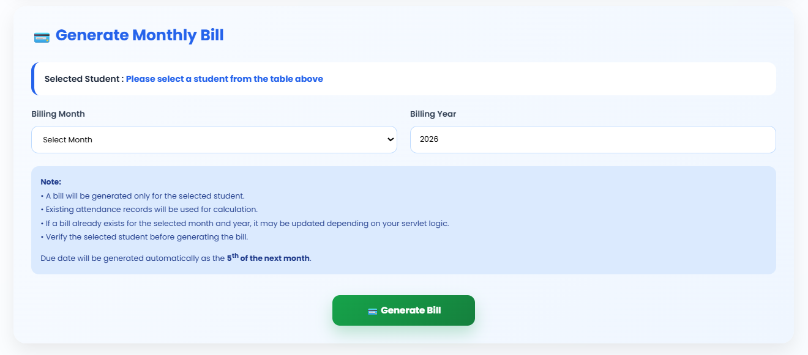 |

---

### 📧 Automatic Bill Email

After bill generation, the system automatically sends an email to the student's registered email address.

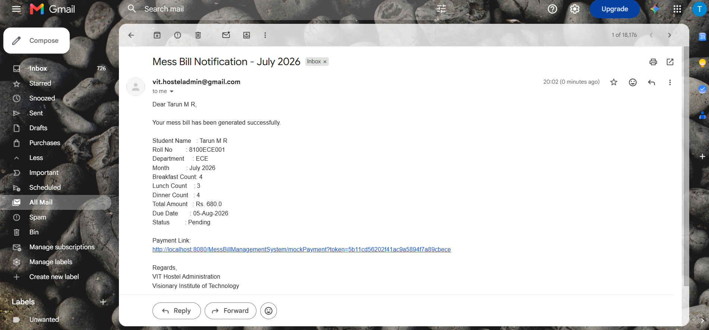

---

### 📄 Bill History

| History 1 | History 2 |
|-----------|-----------|
| 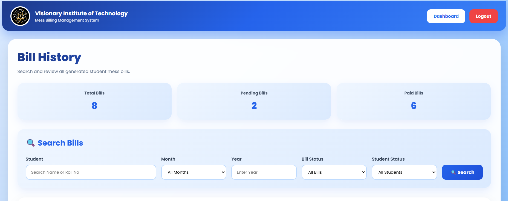 | 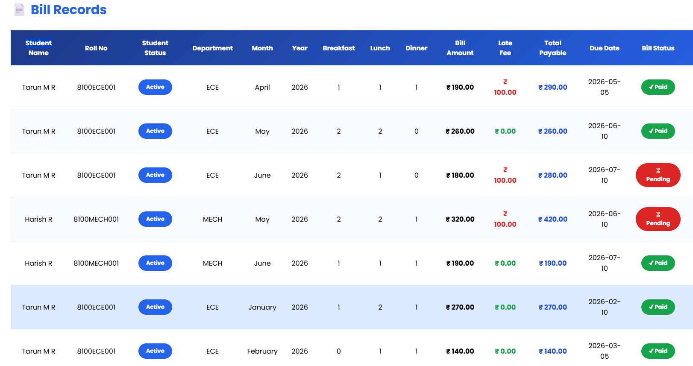 |

---

### 📋 View Bills

| Bills 1 | Bills 2 |
|----------|----------|
| 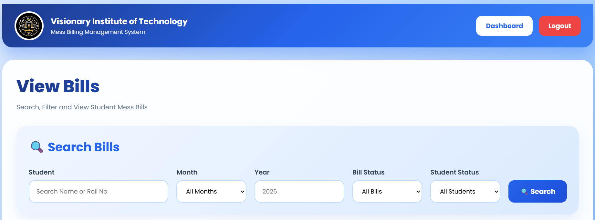 | 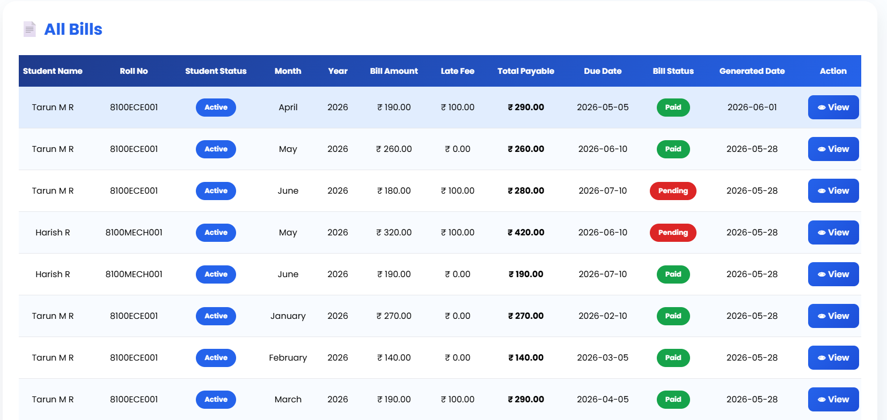 |

---

### 💳 Payment Page

Students can pay directly using the secure payment link received in the email.

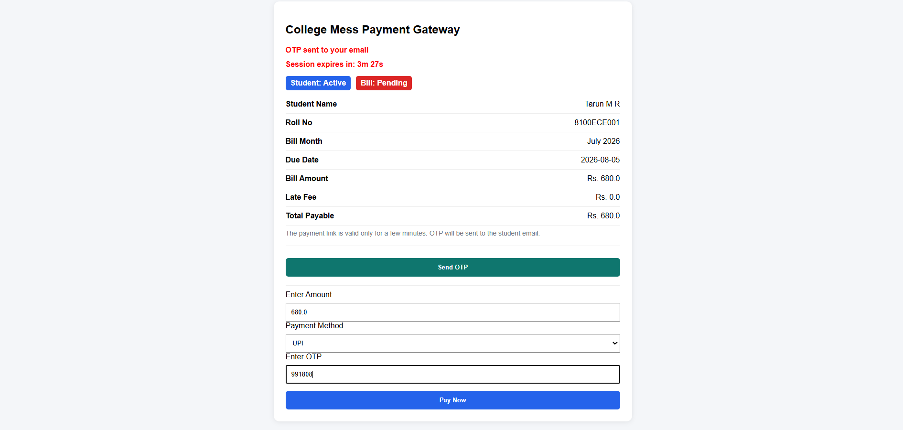

---

### 💵 Payment Records

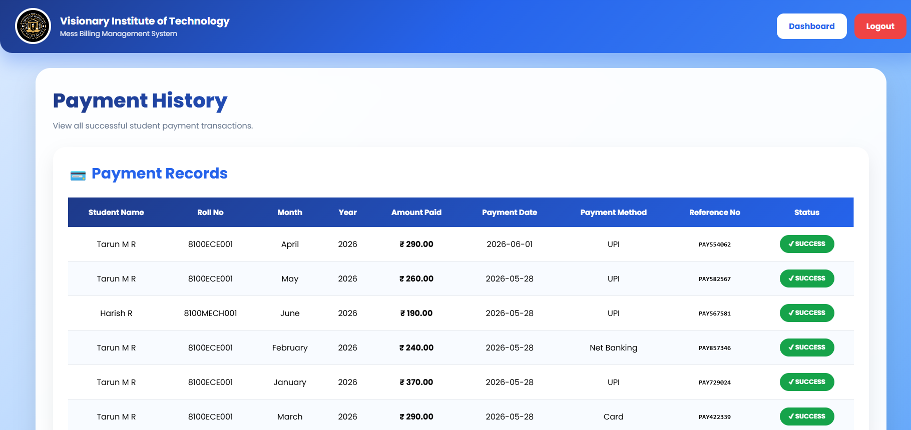

---

### ✅ Payment Success

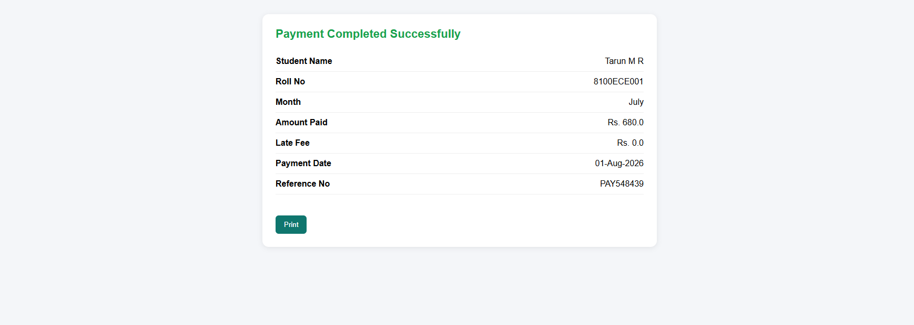

---

### 📧 Payment Confirmation Email

After successful payment, a confirmation email is automatically sent to the student.

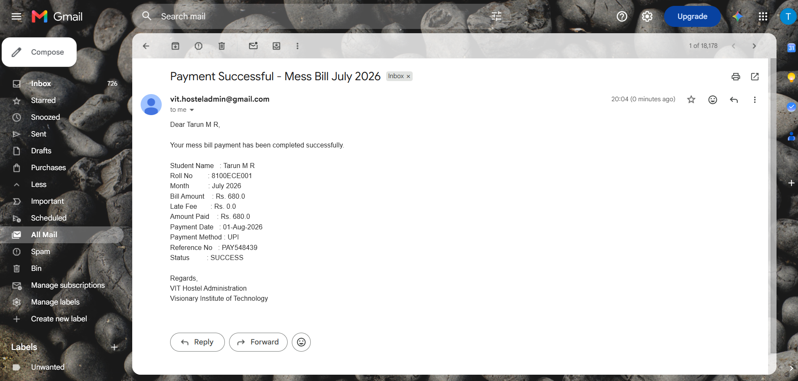

---

### 📊 Reports Dashboard

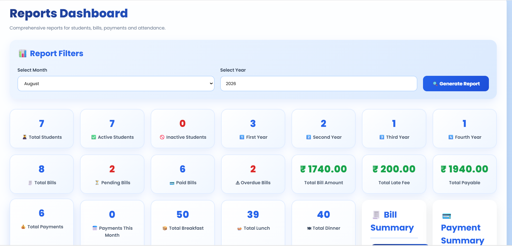

---

## 🔮 Future Enhancements

- Parent Login
- Student Login
- Online Payment Gateway Integration
- SMS Notifications
- Analytics Dashboard
- Spring Boot Migration

---

## 👨‍💻 Author

**Tarun M R**

- LinkedIn: *(Add your LinkedIn URL)*
- GitHub: https://github.com/tarun010604

---

⭐ If you like this project, don't forget to star the repository.
